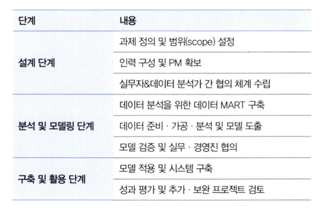
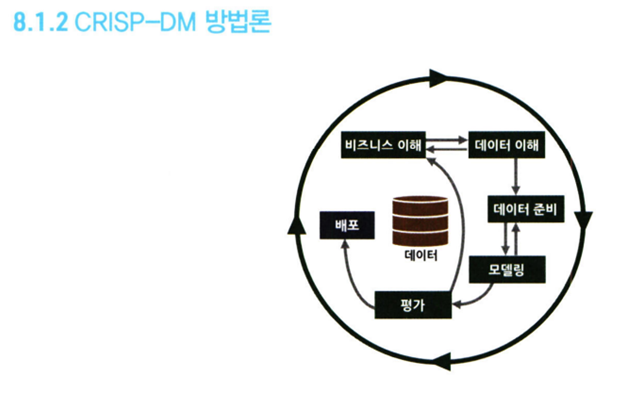
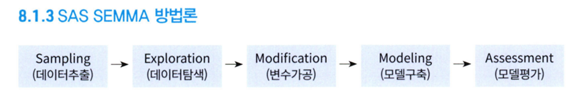
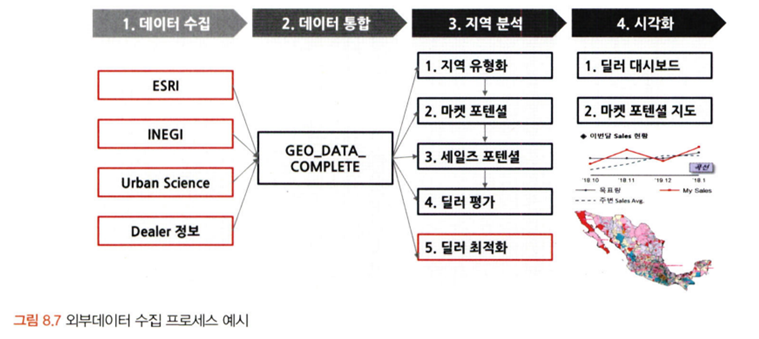
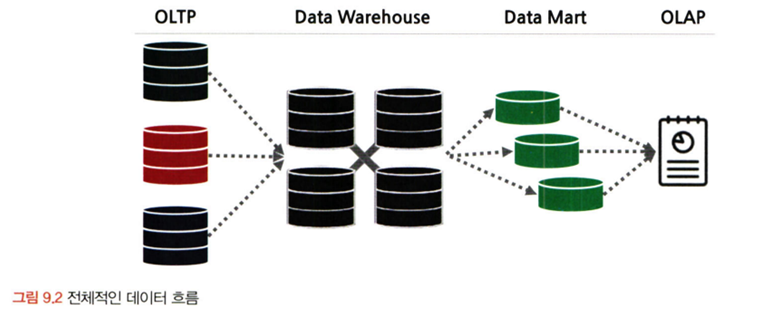
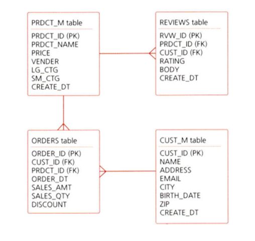

# 통계학 3주차 정규과제

📌통계학 정규과제는 매주 정해진 분량의 『*데이터 분석가가 반드시 알아야 할 모든 것*』 을 읽고 학습하는 것입니다. 이번 주는 아래의 **Statistics_3rd_TIL**에 나열된 분량을 읽고 `학습 목표`에 맞게 공부하시면 됩니다.

아래의 문제를 풀어보며 학습 내용을 점검하세요. 문제를 해결하는 과정에서 개념을 스스로 정리하고, 필요한 경우 추가자료와 교재를 다시 참고하여 보완하는 것이 좋습니다.

3주차는 `2부-데이터 분석 준비하기`를 읽고 새롭게 배운 내용을 정리해주시면 됩니다


## Statistics_3rd_TIL

### 2부. 데이터 분석 준비하기

### 08. 분석 프로젝트 준비 및 기획

### 09. 분석 환경 세팅하기


## Study ScheduleStudy Schedule

| 주차  | 공부 범위     | 완료 여부 |
| ----- | ------------- | --------- |
| 1주차 | 1부 p.2~46    | ✅         |
| 2주차 | 1부 p.47~81   | ✅         |
| 3주차 | 2부 p.82~120  | ✅         |
| 4주차 | 2부 p.121~167 | 🍽️         |
| 5주차 | 2부 p.168~202 | 🍽️         |
| 6주차 | 3부 p.203~250 | 🍽️         |
| 7주차 | 3부 p.251~299 | 🍽️         |

<!-- 여기까진 그대로 둬 주세요-->


# 1️⃣ 개념 정리 

## 08. 분석 프로젝트 준비 및 기획

```
✅ 학습 목표 :
* 데이터 분석 프로세스를 설명할 수 있다.
* 비즈니스 문제를 정의할 때 주의할 점을 설명할 수 있다.
* 외부 데이터를 수집하는 방법에 대해 인식한다.
```
데이터 분석의 주된 목적 : 효과적인 결정을 할 수 있도록 도움을 주는 것

데이터 분석 프로젝트의 전체 프로세스 도식
---


 
설계 단계 : 데이터 분석에 들어가기에 앞서 무엇을 하고자 하는지를 명확히 정의하고 프로젝트를 수행할 인력을 구성함

분석 및 모델링 단계 : 데이터 분석 및 모델링을 위한 서버 환경을 마련하고 본격적인 데이터 분석 과 모델링함
-	분석 단계 : 데이터 추출, 검토, 가공, 모델링 등의 세부 절차와 부분 반복이 필요함
-	모델링 단계 : 모델의 비즈니스 적합성을 심도 있게 분석하고, 성능을 평가하는 것이 중요함

구축 및 활용 단계 : 최종적으로 선정된 분석 모델을 실제 업무에 적용하고 그 성과를 측정함
-	분석 모델 적용을 통 한 예상 개선 효과를 측정할 때 시스템 적용을 위한 비용도 함께 고려해야 함
-	모델이 적용된 후에는 기존보다 얼마나 개선됐는지 효과를 측정하고 평가해야 함

CRISP-DM 방법론
---


 
1단계 비즈니스 이해
-	현재 상황 평가 -> 데이터 마이닝 목표 결정 -> 프로젝트 계획 수립
2단계 데이터 이해
-	데이터 설명 -> 데이터 탐색 -> 데이터 품질 확ㅇ니
3단계 데이터 준비
-	데이터 선택 -> 데이터 정제 -> 필수 데이터 구성 -> 데이터 통합
4단계 모델링
-	모델링 기법 선정 -> 테스트 디자인 선정 -> 모델 생성 -> 모델 평가
5단계 평가
-	결과 평가 -> 프로세스 검토 -> 다음 단계 결정
6단계 배포
-	배포 계획 -> 모니터링 및 유지 관리 계획 -> 최종 보고서 작성 -> 프로젝트 검토

SAS SEMMA 방법론
---


 
1단계 Sampling
-	전체 데이터에서 분석용 데이터 추출 -> 의미 있는 정보를 추출하기 위한 데이터 분할 및 병합 -> 표본추출을 통해 대표성을 가진 분석용 데이터 생성 -> 분석 모델 생성을 위한 학습, 검증, 테스트 데이터셋 분할

2단계 Exploration
-	통계치 확인, 그래프 생성 등을 통해 데이터 탐색 -> 상관분석, 클러스터링 등을 통해 변수 간의 관계 파악 -> 분석 모델에 적합한 변수 선정 -> 데이터 현황을 파악하여 비즈니스 아이디어 도출 및 분석 방향 수정

3단계 Modification
-	결측값 처리 및 최종 분석 변수 선정 -> 로그변환, 구간화(Binning) 등 데이터 가공 -> 주성분분석(PCA) 등을 통해 새로운 변수 생성

4단계 Modeling
-	다양한 데이터마이닝 기법 적용에 대한 적합성 검토 -> 비즈니스 목적에 맞는 분석 모델을 선정하여 분석 알고리즘 적용 -> 지도학습, 비지도학습, 강화학습 등 데이터 형태에 따라 알맞은 모델 선정 -> 분석 환경 인프라 성능과 모델 정확도를 고려한 모델 세부 옵션 설정

5단계 Assessment
-	구축한 모델들의 예측력 등 성능을 비교, 분석, 평가 -> 비즈니스 상황에 맞는 적정 임계치(Cut off) 설정 -> 분석 모델 결과를 비즈니스 인사이트에 적용 -> 상황에 따라 추가적인 데이터 분석 수행

비즈니스 문제 정의 접근법 : MECE (Mutually Exclusive Collectively Exhaustive)
-	세부 정의들이 서로 겹치지 않고 전체를 합쳤을 때는 빠진 것 없이 완전히 전체를 이루는 것을 의미함
-	로직 트리(Logic Tree)를 활용하여 세부 항목을 정리함

비즈니스 문제는 현상에 대한 설명으로 끝나서는 안 되 고, 본질적인 문제점이 함께 전달되어야 하는 것
 
비즈니스 이해 및 문제 정의가 조금이라도 잘못되면 최종 인사이트 도출 및 솔루션 적용 단계에서 제대로 된 효과를 보기 힘듦
도메인 지식(Domain Knowledge)
-	해당되는 분야의 업에 대한 이해도
-	해당 분야의 특성과 프로세스를 제대로 파악하지 못한 상태에서는 문제 정의와 분석 목적이 1차원적일 수밖에 없음
-	직접 의미 있는 변수를 찾아내고 분석 방향을 설정하는 것은 도메인 지식이 충 분하게 수반됐을 때 가능함

외부 데이터 수집과 크롤링
---



외부 데이터 수집
-	정형, 반정형, 비정형 등의 다양한 유형의 데이터를 수집하는 것을 뜻함
-	외부 데이터를 수집할 때는 일반적으로 다수의 경로에서 다양한 데이터를 한꺼번에 수집한 다음 머 신러닝 모델이나 분석 목적에 맞도록 통합하고 가공한 후 비즈니스에 활용함

외부 데이터 수집 방법
1.	데이터를 판매하는 전문 기업으로부터 필요 한 데이터를 구매하거나 MOU 등을 통해 데이터를 공유하는 방법
2.	공공 오픈 데이터를 제공하는 사이트에서 엑셀이나 csv 형태로 데이터를 받아서 활용하는 방법
3.	웹에 있는 데이터를 크롤링하여 수집하는 방법

크롤링
-	장점 : 원하는 데이터를 실시간 으로 자유롭게 수집할 수 있다
-	BUT 데이터 수집을 위한 프로그래밍이 필요하며 해당 웹페이지가 리뉴얼되면 이에 맞춰 수집 코드도 수정해야 함, 기업에서 크롤링을 활용할 때는 법적인 이슈도 함께 고려해야 함

크롤링 – 스크래핑
-	크롤링은 웹 페이지가 주어지면 그 페이지 내에 있는 링크들을 따라가면서 모든 내용을 다 가져오는 것 / 스크래핑은 웹 페이지에서 자신이 원하는 부분의 정보만 가져오는 것

크롤링 방법(간단 ver.)
-	웹사이트의 HTML 구조를 활용하여 원하는 데이터가 있는 위치를 사전에 설정하여 자동으로 반복적으로 특정 위치에 있는 텍스트를 수집하는 것


## 09. 분석 환경 세팅하기

```
✅ 학습 목표 :
* 데이터 분석의 전체적인 프로세스를 설명할 수 있다.
* 테이블 조인의 개념과 종류를 이해하고, 각 조인 방식의 차이를 구분하여 설명할 수 있다.
* ERD의 개념과 역할을 이해하고, 기본 구성 요소와 관계 유형을 설명할 수 있다.
```

데이터 분석
---

데이터 분석 프로그래밍 언어 
-	상업용 데이터 분석 솔루션 : SAS, SPSS(사회과학을 위해 개발된 통계 프로그램, 기업에서 사용 적합 X)
-	오픈소스 : R, Python

SAS(Statistical Analysis System)
1.	제품형 데이터 분석 솔루션
2.	프로그래밍 언어보다는 솔루션에 가까움
3.	역사가 깊음 -> 신뢰도가 높음
4.	성능이 확실하고 지원이 잘 됨
5.	정확성이 중요한 금융업계 기업에서 사용도 높음
6.	SAS Enterprise Miner라는 GUI 기반의 데이터 마이닝 도구를 지원하기 때문에 프로그래밍 스킬이 부족한 사람도 데이터 분석을 하는 것이 어느 정도 가능
7.	상용 솔루션인 만큼 고객 서비스의 이점은 확실
8.	데이터 시 각화를 쉽게 할 수 있다는 장점
9.	딥러닝, 인공신경망 분석에서는 R이나 파이썬보다 약한 모습
10.	R과 파이썬을 SAS 환경에서도 사용할 수 있도록 지원하여 기존 고 객의 이탈을 방지하는 전략을 취함

R
1.	오픈소스 데이터 분석용 언어
2.	통계적 기 능이 우수하며 데이터 시각화에 특화
3.	처음에는 학문과 연구에 주로 사용됐지만 요즘은 기업에서도 R을 사용하 는 경우가 많음
4.	오픈소스임에도 불구하고 ggplot2, ggvis, googleVis 등의 강력한 시각화 패키지를 통해 효과적으로 데이터를 시각화 할 수 있음
5.	R은 활 발한 커뮤니티를 활용하여 문제나 궁금증을 해결할 수 있음
6.	파이썬에 비해 프로그래밍적 소양이나 부족해도 사용하는 데에 큰 무리가 없음

파이썬(Python)
1.	파이썬은 C언어로 구현된 프로그래밍 언어 / 매우 유연한 언어
2.	데이터 분석에 국한되지 않고 웹서비스, 응용 프로그램, IoT 등 다양한 분야에서 사용됨
3.	사람이 이해하기에 문법이 쉽고 간단하다는 장점이 있지만 C 언어보다 10~350배 정도 느리다는 단점이 있음
4.	데이터 분석, 데이터 마이닝에는 파이썬이 유용하게 사용됨
5.	영상처리, 딥러닝과 같이 고정적이고 복잡한 연산이 많이 필요한 경우 부분적으로 C 언어를 활용하여 분석 성능을 높이기도 함
6.	10만 개 이상의 패키지가 존재하며 관련 커뮤니티도 매우 활발함
7.	기계학습 도구로 사이킷런(sklearn)과 텐서플로(TensorFlow)가 있고, 판다스(Pandas), 넘파이(NumPy), 맷플 롯립(matplotlib) 등의 데이터 분석용 도구들이 있음
8.	시각화 면에서는 R에 비해 구현이 복잡하고 직관적이지 못하다는 단점이 있음

SQL(Structured Query Language)
1.	관계형 데이터베이스 시스템에서 데이터를 관리 및 처리하기 위해 설계된 언어
2.	대화식 언어이기 때문에 명령문이 짧고 간결
3.	데이터 전처리는 주로 SQL과 파이썬을 조합하여 코드를 짜고 ML 모델은 사이킷런(sklearn) 등의 패키지를 활용

데이터 처리 프로세스
---

OLTP -> DW(ODS) -> DM -> OLAP
 
 

OLTP(On-Line Transaction Processing)
-	실시간으로 데이터를 트랜잭션 단위로 수집, 분류, 저 장하는 시스템
-	데이터가 생성되고 저장되는 처음 단계가 OLTP

DW(Data Warehouse)
-	데이터 창고와 같은 개념
-	수집된 데이터를 사용자 관점에 서 주제별로 통합하여 쉽게 원하는 데이터를 빼낼 수 있도록 저장해 놓은 통합 데이터베이스
-	DW를 통해 OLTP를 보호 하고 데이터 활용 효율을 높일 수 있음
-	비슷한 개념으로 ODS(Operational Data Store, 데이터를 DW에 저장하기 전에 임시로 데이터를 보관하는 중간 단계의 저장소)

DM(Data Mart)
-	사용자의 목적에 맞도록 가공된 일부의 데이터가 저장되는 곳
-	부서나 사용자 집단의 필요 에 맞도록 가공된 개별 데이터 저장소가 DM
-	접근성과 데이터 분석의 효율성을 높일 수 있으며, DW의 시스템 부하를 감소시킬 수 있음
-	ETL(ETL은 데이터의 추출 (Extract), 변환(Transform), 불러내기(Load), 저장된 데이터를 사용자가 요구하는 포맷으 로 변형하여 이동시키는 작업 과정)

분산데이터 처리
---

분산 데이터 처리 : 한 컴퓨터가 처리해야 할 일을 여러 컴퓨터가 나눠서 한 다음 그 결과를 합치는 것

scale-up 방식 : 빅데이터를 처리하기 위해 하나의 컴퓨 터의 용량을 늘리고 더 빠른 프로세서를 탑재하는 것

scale-out 방식 : 분산데이터 처리처럼 여러 대의 컴퓨터를 병렬적으로 연결하는 것

HDFS(Hadoop Distributed File System)
-	슬레이브 노드(Slave node), 마스터 노드(Master node), 클라이언트 머신(Client machines)
-	슬레이브 노드 : 데이터를 저장하고 계산하는 세부적인 역할
-	마스터 노드 : 대량의 데이터를 HDFS에 저장하고 맵리듀스 방식을 통해 데이터를 병렬 처리하는 역할
-	클라이언트 머신 : 맵리 듀스 작업을 통해 산출된 결과를 사용자에게 보여주는 역할

맵리듀스 (Mapreduce)
-	맵리듀스는 크게 맵(Map)과 리듀스(Reduce)라는 두 단계로 구성
-	맵 단계 : 흩어져 있는 데이터를 관련된 데이터끼리 묶어서 임시의 집합을 만드는 과정
-	리듀스 단계 : 필터링과 정렬을 거쳐 데이터를 뽑아냄
-	맵리듀스의 중요한 특징은 key-value 쌍으로 데이터를 처리한다는 것

테이블 조인과 정의서 그리고 ERD
---

테이블 조인
-	조인은 2개 이상의 테이블을 공통의 칼럼을 중심으로 결합하는 것
-	이너 조인(inner join) - 두 테이블 간에 겹치는 부분의 행만 가져오는 조인 방법
-	아우터 조인(outer join)
-	레프트 조인(left join) - 왼쪽에 있는 모든 행을 가져오고, 오른쪽에 매칭되는 값이 없으면 NULL로 채움
-	라이트 조인(right join) - 오른쪽에 있는 모든 행을 가져오고, 왼쪽에 매칭되는 값이 없으면 NULL로 채움
-	풀 조인(full join) - 모든 행을 살리는 조인 방법이
-	크로스 조인 (cross join) - 주로 머신러닝에 사용되는 데이터셋을 생성할 때 사용, 값이 없더라도 모든 행이 생기도록 데이터 가공을 해야 할 때 크로스 조인을 사용

데이터 단어사전 : 각 칼럼과 테이블의 이름을 정할 때 체계를 약속한 일종의 사전

메타데이터 관리 시스템 : 데이터가 어디에 어떻게 저장되어 있는지, 그리고 데이터를 어떻게 사용할 것 인지 이해할 수 있도록 데이터에 대한 정보를 관리하는 시스템

테이블 정의서 : 각 DW, DM 등에 적재된 테이블과 칼럼의 한글과 영문명, 데이터 속성, 그리고 간단한 설명 등이 정리 된 표

ERD(Entity Relationship Diagram)

 

-	각 테이블의 구성 정보와 테이블 간 관계를 도식으로 표현한 그림 형태로 구성
-	'ERWin'이라는 프로그램을 많이 사용
-	테이블은 엔티티(Entity)라고 불리며 각 테이블이 어떤 테이블과 어떤 키로 연결되어 있는지 직관적으로 확인할 수 있음
-	물리(physical)와 논리(logical)로 구분
-	물리 : DB를 효율적이고 결점 없이 구현하는 것을 목 표로 구현하는 ERD 개념
-	논리 : 데이터 사용자 입장에서 테이블 간 매핑(Mapping)에 오류가 없으며 데이터의 정규화가 이루어진 ERD의 개념
-	데이터 분석가는 논리 ERD를 보고 DB 구조를 파악
-	핵심은 테이블 간 연결을 해주는 키 칼럼과 연결 관계를 의미하는 식별자
-	키 칼럼은 고객번호 처럼 ID와 같은 개념이며 기본 키(Primary Key)와 외래 키(Foreign Key)로 구분
-	기본 키 : 해당 테이블에서 유일하게 구분되는 칼럼이므로 중복될 수 없으며 결측값을 가질 수 없음
-	외래 키 : 다른 테이블과 연결하기 위한 칼럼이므로 중복이나 결측값이 있을 수 있으며 외래 키가 정 의된 테이블은 자식테이블, 참조되는 테이블은 부모 테이블이라 부름
-	테이블 간에는 1:1로 매칭되는 경우도 있고 1:N, NIN 등으로 연결된 경우도 많기 때문에 이러한 관계 를 정확히 파악하고 데이터를 다뤄야 함


<br>
<br>

---

# 2️⃣ 확인 문제

## 문제 1.

> **🧚 아래의 테이블을 조인한 결과를 출력하였습니다. 어떤 조인 방식을 사용했는지 맞춰보세요.**

> 사용한 테이블은 다음과 같습니다.

| **emp_cd** | **emp_nm** | **job** | **dep_cd** |
| ---------- | ---------- | ------- | ---------- |
| 1001       | 김권택     | 부장    | 30         |
| 1002       | 김미정     | 과장    | 20         |
| 1003       | 이지민     | 대리    | 20         |
| 1004       | 장동혁     | 사원    | 10         |
| 1005       | 이승화     | 사원    | 30         |
| 1006       | 곽주영     | 과장    | 40         |
| 1007       | 조용호     | 사장    | NULL       |
| 1008       | 가나다     | 대리    | 40         |
| 1009       | 홍길동     | 차장    | 10         |

| **dep_cd** | **dep_nm** | **location** |
| ---------- | ---------- | ------------ |
| 10         | 인사팀     | 서울         |
| 20         | 경리팀     | 서울         |
| 30         | 영업팀     | 과천         |
| 40         | 전산팀     | 대전         |
| 50         | 법무팀     | 인천         |

> 보기: INNER, LEFT, RIGHT 조인

<!-- 테이블 조인의 종류를 이해하였는지 확인하기 위한 문제입니다. 각 테이블이 어떤 조인 방식을 이용하였을지 고민해보고 각 테이블 아래에 답을 작성해주세요.-->

### 1-1. 

| **emp_cd** | **emp_nm** | **job** | **dep_cd** | **dep_nm** | **location** |
| ---------- | ---------- | ------- | ---------- | ---------- | ------------ |
| 1001       | 김권택     | 부장    | 30         | 영업팀     | 과천         |
| 1002       | 김미정     | 과장    | 20         | 경리팀     | 서울         |
| 1003       | 이지민     | 대리    | 20         | 경리팀     | 서울         |
| 1004       | 장동혁     | 사원    | 10         | 인사팀     | 서울         |
| 1005       | 이승화     | 사원    | 30         | 영업팀     | 과천         |
| 1006       | 곽주영     | 과장    | 40         | 전산팀     | 대전         |
| 1007       | 김태연     | 사장    |            |            |              |
| 1008       | 최철원     | 대리    | 40         | 전산팀     | 대전         |
| 1009       | 노동희     | 차장    | 10         | 인사팀     | 서울         |

```
여기에 답을 작성해주세요!
```


### 1-2. 

| **emp_cd** | **emp_nm** | **job** | **dep_cd** | **dep_nm** | **location** |
| ---------- | ---------- | ------- | ---------- | ---------- | ------------ |
| 1001       | 김권택     | 부장    | 30         | 영업팀     | 과천         |
| 1002       | 김미정     | 과장    | 20         | 경리팀     | 서울         |
| 1003       | 이지민     | 대리    | 20         | 경리팀     | 서울         |
| 1004       | 장동혁     | 사원    | 10         | 인사팀     | 서울         |
| 1005       | 이승화     | 사원    | 30         | 영업팀     | 과천         |
| 1006       | 곽주영     | 과장    | 40         | 전산팀     | 대전         |
| 1008       | 최철원     | 대리    | 40         | 전산팀     | 대전         |
| 1009       | 노동희     | 차장    | 10         | 인사팀     | 서울         |

```
여기에 답을 작성해주세요!
```


### 1-3. 

| **emp_cd** | **emp_nm** | **job** | **dep_cd** | **dep_nm** | **location** |
| ---------- | ---------- | ------- | ---------- | ---------- | ------------ |
| 1004       | 장동혁     | 사원    | 10         | 인사팀     | 서울         |
| 1009       | 홍길동     | 차장    | 10         | 인사팀     | 서울         |
| 1002       | 김미정     | 과장    | 20         | 경리팀     | 서울         |
| 1003       | 이지민     | 대리    | 20         | 경리팀     | 서울         |
| 1001       | 김권택     | 부장    | 30         | 영업팀     | 과천         |
| 1005       | 이승화     | 사원    | 30         | 영업팀     | 과천         |
| 1006       | 곽주영     | 과장    | 40         | 전산팀     | 대전         |
| 1008       | 최철원     | 대리    | 40         | 전산팀     | 대전         |
|            |            |         | 50         | 법무팀     | 인천         |

```
여기에 답을 작성해주세요!
```


### 🎉 수고하셨습니다.