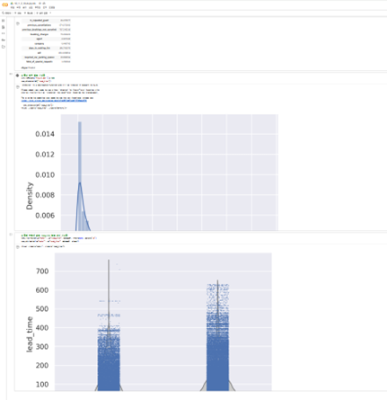
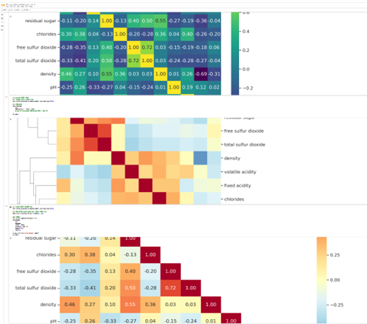
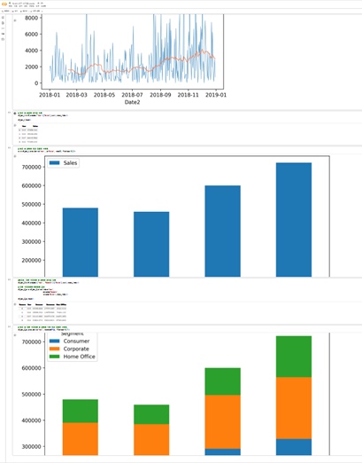
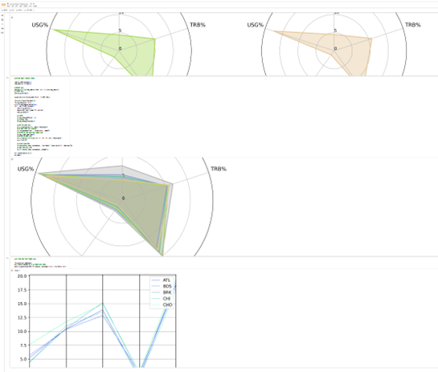

# 통계학 4주차 정규과제

📌통계학 정규과제는 매주 정해진 분량의 『*데이터 분석가가 반드시 알아야 할 모든 것*』 을 읽고 학습하는 것입니다. 이번 주는 아래의 **Statistics_4th_TIL**에 나열된 분량을 읽고 `학습 목표`에 맞게 공부하시면 됩니다.

아래의 문제를 풀어보며 학습 내용을 점검하세요. 문제를 해결하는 과정에서 개념을 스스로 정리하고, 필요한 경우 추가자료와 교재를 다시 참고하여 보완하는 것이 좋습니다.

4주차는 `2부-데이터 분석 준비하기`를 읽고 새롭게 배운 내용을 정리해주시면 됩니다


## Statistics_4th_TIL

### 2부. 데이터 분석 준비하기

### 10. 데이터 탐색과 시각화

<!-- 10. 데이터 탐색과 시각화에서 10.1 탐색적 데이터 분석부터 10.4 비교 시각화 파트까지 진행해주시면 됩니다. -->


**(수행 인증샷은 필수입니다.)** 

<!-- 이번주는 확인 문제가 없고, 교재의 실습에 있는 부분을 따라해주시면 됩니다. 데이터셋과 참고자료는 노션의 정규과제란에 있는 깃허브를 활용해주시면 됩니다. -->


## Study ScheduleStudy Schedule

| 주차  | 공부 범위     | 완료 여부 |
| ----- | ------------- | --------- |
| 1주차 | 1부 p.2~46    | ✅         |
| 2주차 | 1부 p.47~81   | ✅         |
| 3주차 | 2부 p.82~120  | ✅         |
| 4주차 | 2부 p.121~167 | ✅         |
| 5주차 | 2부 p.168~202 | 🍽️         |
| 6주차 | 3부 p.203~250 | 🍽️         |
| 7주차 | 3부 p.251~299 | 🍽️         |

<!-- 여기까진 그대로 둬 주세요-->


---

# 1️⃣ 개념 정리 

## 10. 데이터 탐색과 시각화

```
✅ 학습 목표 :
* EDA의 목적을 설명할 수 있다.
* 주어진 데이터셋에서 이상치, 누락값, 분포 등을 식별하고 EDA 결과를 바탕으로 데이터셋의 특징을 해석할 수 있다.
* 공분산과 상관계수를 활용하여 두 변수 간의 관계를 해석할 수 있다.
* 적절한 시각화 기법을 선택하여 데이터의 특성을 효과적으로 전달할 수 있다.
```

EDA
---

EDA =/= 데이터 시각화
탐색적 데이터 분석(Exploratory Data Analysis; EDA) 
- 가공하지 않은 원천의 데이터를 있는 그대로 탐색하고 분석하는 기법
- 기술통계와 데이터 시각화를 통해 데이터의 특성을 파악하는 것
- EDA를 할 때는 극단적인 해석은 피해야 하며 지나친 추론이나 자의적 해석도 지양

EDA의 주요 목적
- 데이터의 형태와 척도가 분석에 알맞게 되어있는지 확인(sanity checking)
- 데이터의 평균, 분산, 분포, 패턴 등의 확인을 통해 데이터 특성 파악
- 데이터의 결측값이나 이상치 파악 및 보완
- 변수 간의 관계성 파악
- 분석 목적과 방향성 점검 및 보정

info() 함수 : 데이터에 대한 전반적인 정보

describe() : 평균, 표준편차, 최대 최솟값 등을 한 번에 확인할 수 있는 매우 유용한 함수다

왜도 : skew() / 첨도 : kurtosis() 함수

distplot() 함수 : 확인하고자 하는 칼럼의 분포를 시각화

Violinplot() 함수 : 분포를 효과적으로 표현

stripplot() 함수 : 각 관측치의 위치를 직관적으로 표현


공분산 & 상관분석
---

변수 간의 상관관계 파악을 위한 대표적인 개념 – 공분석, 상관계수

상관분석을 하기 위해서는 우선 데이터가 등간이나 비율 척도이며, 두 변수가 선형적 관계라는 가정을 둔다.

- 공분산 : 두 확률변수의 함께 움직이는 방향성을 수치로 나타낸 것
	- Cov(X,Y) > 0 → X와 Y가 같은 방향으로 움직임 (X↑ → Y↑, X↓ → Y↓) / Cov(X,Y) < 0 → X와 Y가 반대 방향으로 움직임 (X↑ → Y↓) / Cov(X,Y) ≈ 0 → X와 Y의 관련성 거의 없음.

- 상관계수 : 공분산을 각 변수의 표준편차로 나누어 무단위화(normalization) 한 값
	- +1 → 완벽한 양의 선형 관계 / -1 → 완벽한 음의 선형 관계 / 0 → 선형적 관계 없음 (하지만 비선형 관계는 있을 수 있음)

산점도의 기울기와 상관계수는 관련이 없음. 분산의 관계성이 같다면, 기울기가 크든 작든 상관계수는 같음.

결정계수 : 상관계수를 제곱한 값, 총 변동 중에서 회귀선에 의해 설명되는 변동이 차지하는 비율


시간 시각화
---

선그래프는 시간 간격의 밀도가 높을 때 사용

추세선을 그리는 가장 일반적인 방법은 이동평균(Moving average)를 이용하는 것 
- 데이터의 연속적 그룹의 평균을 구하는 것

누적 막대그래프는 한 시점에 2개 이상의 세부 항목이 존재할 때 사용

평행 좌표 그래프를 보다 효과적으로 표현하려면 변수별 값을 정규화하면 됨
- 가장 낮은 값은 0%로, 가장 높은 값을 100%로 변환하여 차이를 부각


비교 시각화
---

아래 사진 첨부


<br>
<br>

---

# 2️⃣ 확인 과제

> **교재에 있는 실습 파트를 직접 따라 해보세요. 실습을 완료한 뒤, 결과화면(캡처 또는 코드 결과)을 첨부하여 인증해 주세요.단순 이론 암기보다, 직접 손으로 따라해보면서 실습해 보는 것이 가장 확실한 학습 방법입니다.**
>
> > **인증 예시 : 통계 프로그램 결과, 시각화 이미지 캡처 등**









~~~
인증 이미지가 없으면 과제 수행으로 인정되지 않습니다.
~~~


### 🎉 수고하셨습니다.