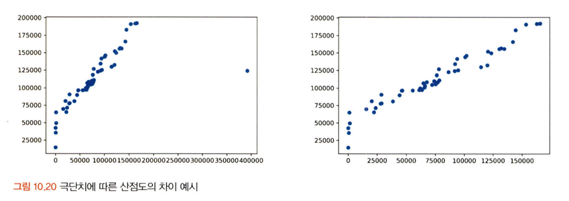
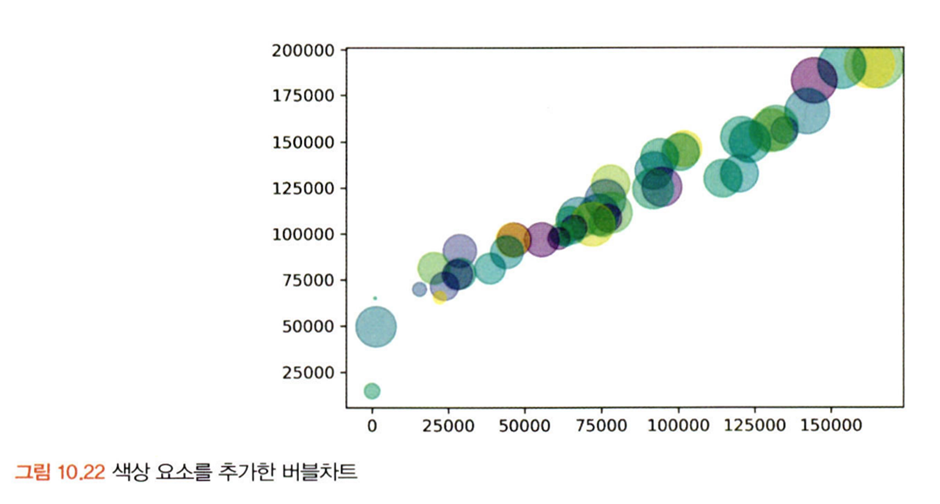
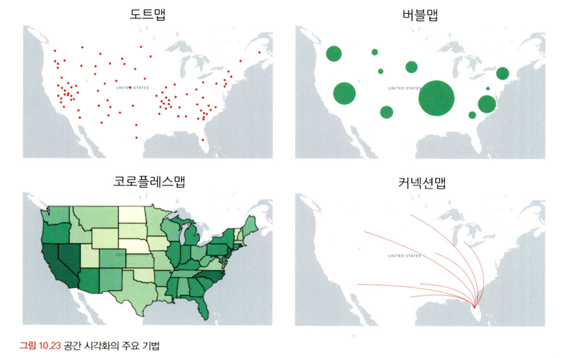
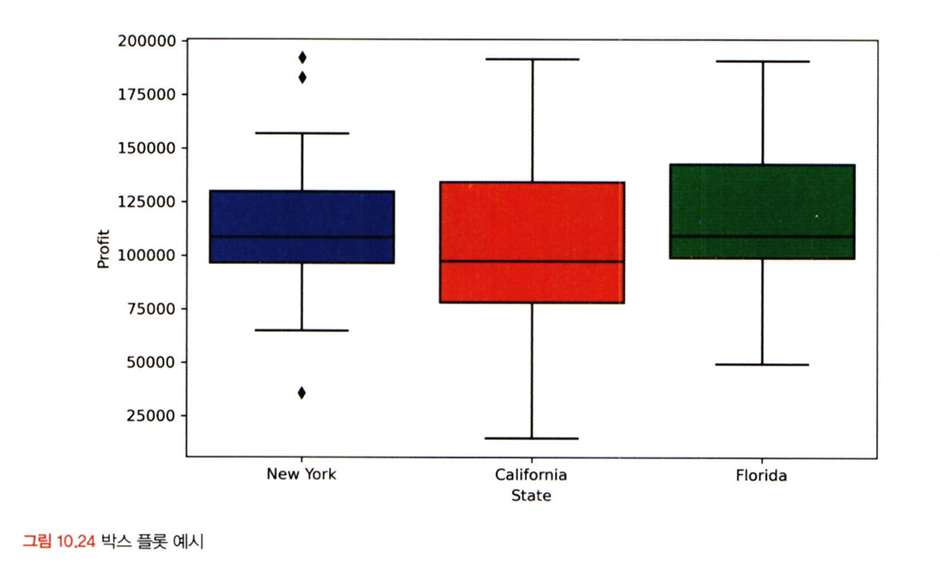
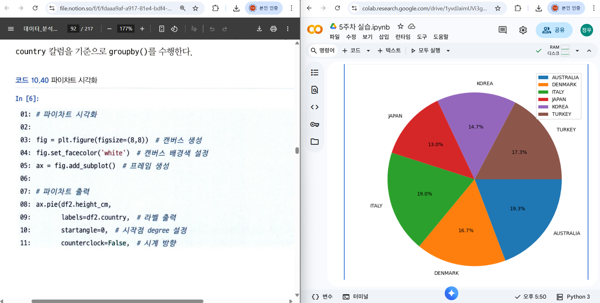

# 통계학 5주차 정규과제

📌통계학 정규과제는 매주 정해진 분량의 『*데이터 분석가가 반드시 알아야 할 모든 것*』 을 읽고 학습하는 것입니다. 이번 주는 아래의 **Statistics_5th_TIL**에 나열된 분량을 읽고 `학습 목표`에 맞게 공부하시면 됩니다.

아래의 문제를 풀어보며 학습 내용을 점검하세요. 문제를 해결하는 과정에서 개념을 스스로 정리하고, 필요한 경우 추가자료와 교재를 다시 참고하여 보완하는 것이 좋습니다.

5주차는 `2부-데이터 분석 준비하기`를 읽고 새롭게 배운 내용을 정리해주시면 됩니다


## Statistics_5th_TIL

### 2부. 데이터 분석 준비하기

### 10. 데이터 탐색과 시각화

- 10.5 분포 시각화부터 10장 마지막 10.8 박스 플롯까지 진행해주시면 됩니다.

**(수행 인증샷은 필수입니다.)** 

<!-- 이번주는 확인 문제가 없고, 교재의 실습에 있는 부분을 따라해주시면 됩니다. 데이터셋과 참고자료는 노션의 정규과제란에 있는 깃허브를 활용해주시면 됩니다. -->

## Study ScheduleStudy Schedule

| 주차  | 공부 범위     | 완료 여부 |
| ----- | ------------- | --------- |
| 1주차 | 1부 p.2~46    | ✅         |
| 2주차 | 1부 p.47~81   | ✅         |
| 3주차 | 2부 p.82~120  | ✅         |
| 4주차 | 2부 p.121~167 | ✅         |
| 5주차 | 2부 p.168~202 | ✅         |
| 6주차 | 3부 p.203~250 | 🍽️         |
| 7주차 | 3부 p.251~299 | 🍽️         |

<!-- 여기까진 그대로 둬 주세요-->

---

# 1️⃣ 개념 정리 

## 10. 데이터 탐색과 시각화

```
✅ 학습 목표 :
* EDA의 목적을 설명할 수 있다.
* 주어진 데이터셋에서 이상치, 누락값, 분포 등을 식별하고 EDA 결과를 바탕으로 데이터셋의 특징을 해석할 수 있다.
* 공분산과 상관계수를 활용하여 두 변수 간의 관계를 해석할 수 있다.
* 적절한 시각화 기법을 선택하여 데이터의 특성을 효과적으로 전달할 수 있다.
```


분포 시각화
---

연속형 – 양적 척도

명목형 – 질적 척도

양적 척도 – 막대 그래프, 선 그래프, 히스토그램(막대 그래프)

질적 척도 – 구성 요소 단순 -> 파이차트, 도넛차트 / 구성 요소 복잡 -> 트리맵 차트, 와플차트
 


관계 시각화
---

산점도 -> 쉽게 이해하고 표현 가능

하나의 요소는 X축, 하나의 요소는 Y축에 대입하여 일치하는 지점에 점을 찍으면 됨

극단치로 인해 주요 분포 구간이 압축되어 시각화의 효율이 떨어질 수 있으니 제거하고 그리는 것이 좋음

 

산점도는 두 개의 변수 간 관계만을 표현할 수 있다는 단점
    -> 버블 차트를 이용하면 세 가지 요소의 상관관계 표현 가능, 색상을 추가한다면 네 가지 요소도 비교 가능
 


버블차트 해석 시에는 원의 지름이 아닌 면적을 통해 크기를 판단하도록 주의해야 함

지름이 두배가 크면 실제 면적으로는 네 배가 큰 것이기 때문


공간 시각화
---

공간 시각화 -> 일반적인 시각화 방법처럼 단순 이미지 표현이 아닌, 인터랙티브한 활용 가능 -> 거시적에서 미시적으로 진행되는 분석 방향과 같이 스토리라인을 잡고 시각화를 적용하는 것이 좋음

 

도트맵 – 지리적 위치에 동일한 크기의 작은 점을 찍어 해당 지역의 데이터 분포나 패턴을 표현하는 기법

버블맵 – 버블차트를 지도에 그대로 옮겨 둔 것, 데이터 값이 원으로 표현되기에 코로플레스맵보다 비율을 비교하기에 효율적

코로플레스맵 – 단계 구분도, 데이터 값의 크기에 따라 색상의 음영을 달리하여 해당 지역에 대한 값을 시각화하는 기법

커넥션맵(링크맵) – 지도에 찍힌 점들을 곡선 또는 직선으로 연결하여 지리적 관계를 표현


박스 플롯
---

박스 플롯(상자 수염 그림, Box-and-Whisker Plot) – 네모 상자 모양에 최댓값과 최솟값을 나타내는 선이 결합된 모양의 데이터 시각화 방법

하나의 그림으로 양적 척도 데이터의 분포 및 편향성, 평균과 중앙값 등 다양한 수치를 보기 쉽게 정리해 줌

 

주로 데이터의 대체적인 분포 형태를 파악하기 위해 사용

박스 플롯의 다섯 가지 수치
    1. 최솟값: 제1사분위에서 1.5IQR을 뺀 위치
    2. 제1사분위: 25%의 위치
    3. 제2사분위: 50%의 위치(중앙값-median을 의미)
    4. 제3사분위: 75%의 위치
    5. 최댓값: 제3사분위에서 1.5IQR을 더한 위치


<br>
<br>

---

# 2️⃣ 확인 과제

> **교재에 있는 실습 파트를 직접 따라 해보세요. 실습을 완료한 뒤, 결과화면(캡처 또는 코드 결과)을 첨부하여 인증해 주세요.단순 이론 암기보다, 직접 손으로 따라해보면서 실습해 보는 것이 가장 확실한 학습 방법입니다.**
>
> > **인증 예시 : 통계 프로그램 결과, 시각화 이미지 캡처 등**



~~~
인증 이미지가 없으면 과제 수행으로 인정되지 않습니다.
~~~


### 🎉 수고하셨습니다.